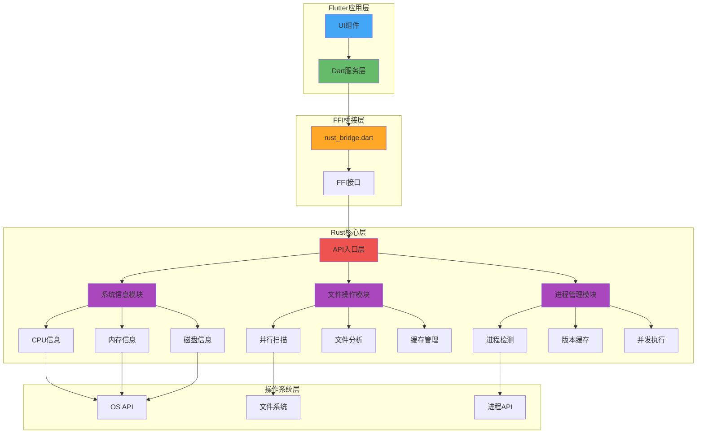
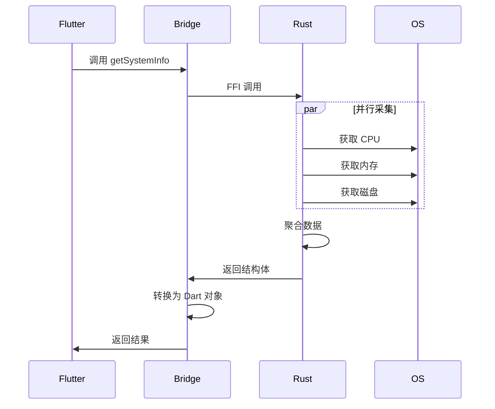
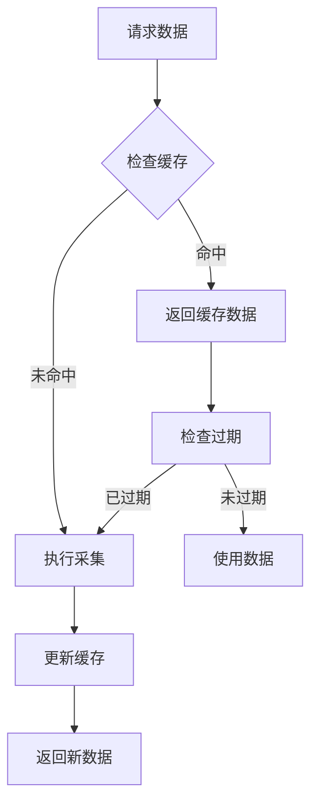

# Rust 核心模块架构设计

## 🏗️ 整体架构图



## 📦 模块详细设计

### 1. 系统信息采集模块

#### 模块结构
```
system_info/
├── mod.rs          # 模块入口
├── cpu.rs          # CPU 信息采集
├── memory.rs       # 内存信息采集
├── disk.rs         # 磁盘信息采集
├── network.rs      # 网络信息采集
└── os.rs           # 操作系统信息
```

#### 核心 API 设计
```rust
// 主结构体
pub struct SystemInfo {
    pub cpu: CpuInfo,
    pub memory: MemoryInfo,
    pub disk: DiskInfo,
    pub network: NetworkInfo,
    pub os: OsInfo,
}

// CPU 信息
pub struct CpuInfo {
    pub model: String,
    pub cores: u32,
    pub threads: u32,
    pub frequency: u64,
    pub usage: f32,
}

// 内存信息
pub struct MemoryInfo {
    pub total: u64,
    pub available: u64,
    pub used: u64,
    pub usage_percent: f32,
}

// 并行采集函数
pub async fn get_system_info() -> Result<SystemInfo, String> {
    let (cpu, memory, disk, network, os) = tokio::join!(
        get_cpu_info(),
        get_memory_info(),
        get_disk_info(),
        get_network_info(),
        get_os_info()
    );
    
    Ok(SystemInfo {
        cpu: cpu?,
        memory: memory?,
        disk: disk?,
        network: network?,
        os: os?,
    })
}
```

#### 性能优化策略
1. **直接系统调用**: 避免启动子进程
2. **并行采集**: 利用 tokio 异步并发
3. **智能缓存**: 15分钟有效期,减少重复查询
4. **零拷贝**: 使用引用传递大数据

### 2. 文件操作模块

#### 模块结构
```
file_ops/
├── mod.rs          # 模块入口
├── scanner.rs      # 文件扫描器
├── analyzer.rs     # 项目分析器
├── filter.rs       # 智能过滤器
└── cache.rs        # 扫描缓存
```

#### 核心 API 设计
```rust
// 扫描配置
pub struct ScanConfig {
    pub path: String,
    pub max_depth: Option<usize>,
    pub ignore_patterns: Vec<String>,
    pub parallel: bool,
}

// 扫描结果
pub struct ScanResult {
    pub files: Vec<FileInfo>,
    pub total_size: u64,
    pub file_count: usize,
    pub dir_count: usize,
    pub duration_ms: u64,
}

// 并行扫描
pub fn scan_directory_parallel(config: ScanConfig) -> Result<ScanResult, String> {
    use rayon::prelude::*;
    
    let entries: Vec<_> = WalkDir::new(&config.path)
        .max_depth(config.max_depth.unwrap_or(usize::MAX))
        .into_iter()
        .par_bridge()  // 转换为并行迭代器
        .filter_map(|e| e.ok())
        .filter(|e| !should_ignore(e, &config.ignore_patterns))
        .map(|e| analyze_entry(e))
        .collect();
    
    Ok(build_result(entries))
}
```

#### 性能优化策略
1. **并行处理**: 使用 rayon 的 par_bridge
2. **智能过滤**: 预先过滤 node_modules, .git 等
3. **内存映射**: 大文件使用 mmap
4. **批量操作**: 减少 FFI 调用次数

### 3. 进程管理模块

#### 模块结构
```
process_mgr/
├── mod.rs          # 模块入口
├── detector.rs     # 版本管理器检测
├── executor.rs     # 命令执行器
├── cache.rs        # 结果缓存
└── types.rs        # 类型定义
```

#### 核心 API 设计
```rust
// 缓存管理器
pub struct CacheManager {
    cache: Arc<RwLock<HashMap<String, CachedResult>>>,
    ttl: Duration,
}

// 缓存结果
struct CachedResult {
    data: String,
    timestamp: Instant,
}

// 并发检测多个管理器
pub async fn detect_all_managers() -> Vec<ManagerInfo> {
    let managers = vec!["nvm", "fnm", "volta", "nvs", "n", "nodenv"];
    
    futures::stream::iter(managers)
        .map(|name| async move {
            detect_manager(name).await
        })
        .buffer_unordered(6)  // 最多6个并发
        .filter_map(|r| async { r.ok() })
        .collect()
        .await
}

// 智能缓存检测
pub async fn detect_with_cache(name: &str) -> Result<ManagerInfo, String> {
    // 检查缓存
    if let Some(cached) = cache.get(name) {
        if !cached.is_expired() {
            return Ok(cached.data.clone());
        }
    }
    
    // 执行检测
    let result = detect_manager(name).await?;
    
    // 更新缓存
    cache.insert(name, result.clone());
    
    Ok(result)
}
```

#### 性能优化策略
1. **智能缓存**: 避免重复检测,5分钟 TTL
2. **并发执行**: 同时检测多个管理器
3. **快速失败**: 超时机制,避免阻塞
4. **命令池**: 复用进程资源

## 🔄 数据流设计

### FFI 数据传输流程



### 缓存策略流程



## 🛡️ 错误处理策略

### 统一错误类型
```rust
#[derive(Debug, Clone)]
pub enum AppError {
    SystemError(String),
    IoError(String),
    ParseError(String),
    TimeoutError,
    NotFound(String),
}

impl std::fmt::Display for AppError {
    fn fmt(&self, f: &mut std::fmt::Formatter) -> std::fmt::Result {
        match self {
            AppError::SystemError(msg) => write!(f, "System error: {}", msg),
            AppError::IoError(msg) => write!(f, "IO error: {}", msg),
            AppError::ParseError(msg) => write!(f, "Parse error: {}", msg),
            AppError::TimeoutError => write!(f, "Operation timeout"),
            AppError::NotFound(msg) => write!(f, "Not found: {}", msg),
        }
    }
}
```

### Dart 侧错误处理
```dart
try {
  final info = await RustBridge.getSystemInfo();
  // 使用数据
} on RustError catch (e) {
  // Rust 侧错误
  logger.error('Rust error: ${e.message}');
} catch (e) {
  // 其他错误
  logger.error('Unexpected error: $e');
}
```

## 📊 性能监控

### 内置性能指标
```rust
pub struct PerformanceMetrics {
    pub operation: String,
    pub duration_ms: u64,
    pub memory_used: u64,
    pub cache_hit: bool,
}

// 性能监控装饰器
pub async fn with_metrics<F, T>(name: &str, f: F) -> (T, PerformanceMetrics)
where
    F: Future<Output = T>,
{
    let start = Instant::now();
    let mem_before = get_memory_usage();
    
    let result = f.await;
    
    let duration = start.elapsed();
    let mem_after = get_memory_usage();
    
    let metrics = PerformanceMetrics {
        operation: name.to_string(),
        duration_ms: duration.as_millis() as u64,
        memory_used: mem_after - mem_before,
        cache_hit: false,
    };
    
    (result, metrics)
}
```

## 🔧 开发工具配置

### Cargo.toml 配置
```toml
[package]
name = "rust_core"
version = "0.1.0"
edition = "2021"

[lib]
crate-type = ["cdylib", "staticlib"]

[dependencies]
flutter_rust_bridge = "2"
tokio = { version = "1", features = ["full"] }
sysinfo = "0.30"
walkdir = "2"
rayon = "1.8"
once_cell = "1.19"

[target.'cfg(windows)'.dependencies]
windows = { version = "0.52", features = ["Win32_System_SystemInformation"] }

[profile.release]
opt-level = 3
lto = true
codegen-units = 1
```

### 构建脚本 build.rs
```rust
fn main() {
    // 生成 Flutter Rust Bridge 代码
    flutter_rust_bridge_codegen::generate();
    
    // 平台特定配置
    #[cfg(target_os = "windows")]
    println!("cargo:rustc-link-lib=ntdll");
}
```

## 🎯 关键性能指标 (KPI)

| 指标 | 当前 | 目标 | 测量方法 |
|------|------|------|---------|
| 系统信息采集 | 2-5s | <200ms | 端到端计时 |
| 项目扫描 (1000文件) | 3-10s | <500ms | 目录遍历测试 |
| 版本管理器检测 | 500-1000ms | <50ms | 并发检测测试 |
| 内存占用 | 基准 | <20% 增长 | 内存分析器 |
| FFI 调用延迟 | N/A | <5ms | 微基准测试 |

## 📝 开发检查清单

### 代码质量
- [ ] 所有公共 API 都有文档注释
- [ ] 错误处理覆盖所有边界情况
- [ ] 单元测试覆盖率 > 80%
- [ ] 性能测试通过基准

### 跨平台兼容
- [ ] Windows 10/11 测试通过
- [ ] macOS 测试通过
- [ ] Linux 测试通过
- [ ] 条件编译正确配置

### 安全性
- [ ] 无 unsafe 代码或有充分注释
- [ ] 输入验证完整
- [ ] 资源正确释放
- [ ] 无内存泄漏

### 性能
- [ ] 满足性能目标
- [ ] 缓存策略有效
- [ ] 并发安全
- [ ] 资源占用合理